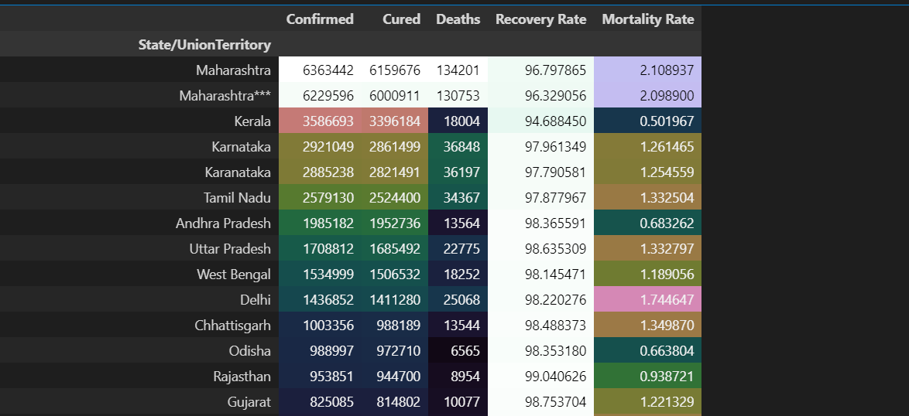
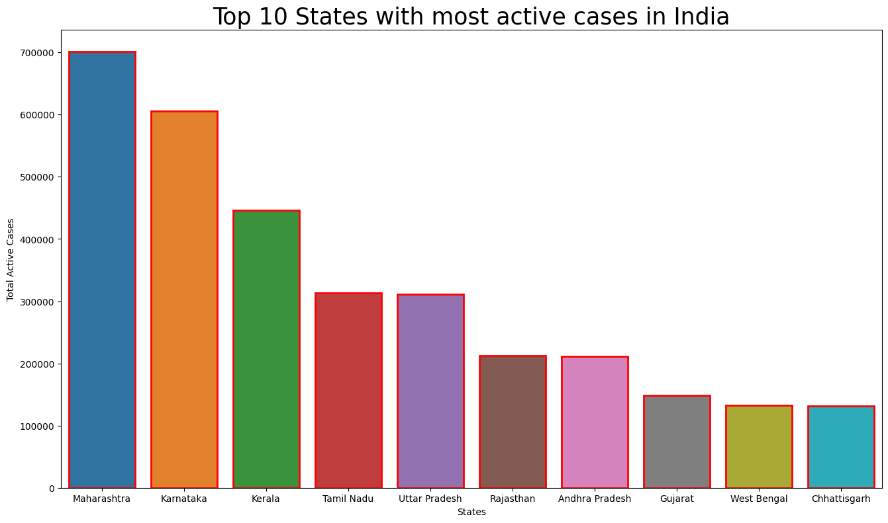
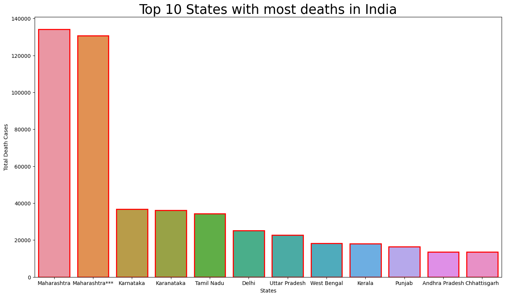
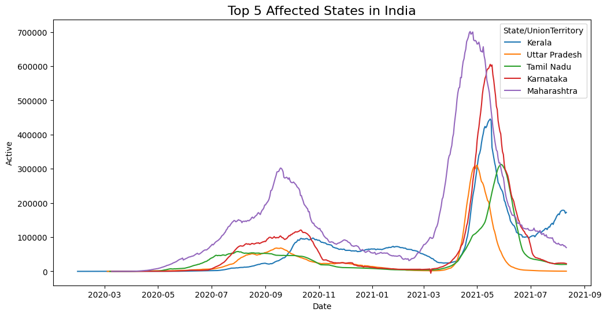
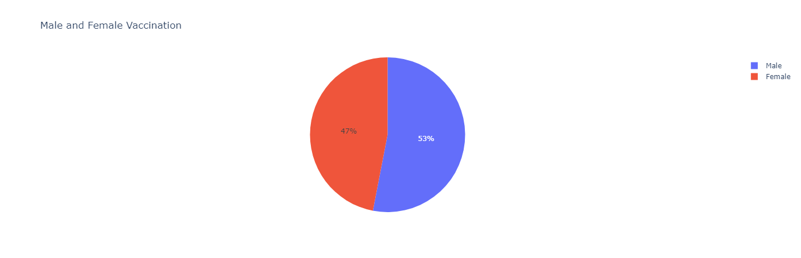
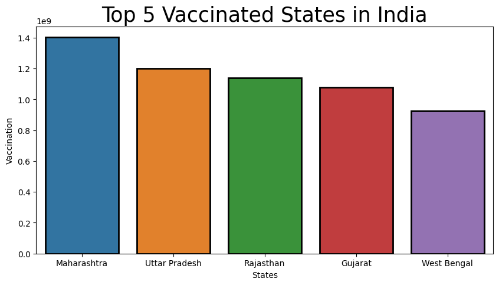

# Data Analyst Enthusiast

## Projects

### Project - 1: Power BI Dashboard for Survey of Data Professionals ([Guided by Alex the Analyst](https://www.youtube.com/watch?v=pixlHHe_lNQ&t=1s&ab_channel=AlexTheAnalyst))
+ Level - Easy

### STEPS : 
[Downloaded the dataset from here](https://github.com/AlexTheAnalyst/Power-BI/blob/main/Power%20BI%20-%20Final%20Project.xlsx)
* Inspected the data in Excel.
* Opened the Data in Power Query
 - Removed unnecessary columns from the table
 - Created an Average Salary column by splitting the salary range column from digit to non-digit and created a custom column that does the average calculation.
 - Transformed the rows containing "other(Please Specify)" options to "others".
* Created a Card view for "count of survey Takers" to view the number of people who participated in the specified survey question.
* Created a Card view for "Average Age" to view the average age of the participants.
* Created a Stacked-column chart to view the Favourite Programming language of the participants.
* Created a Stacked-bar chart to view the Average salary by the job titles of the participants.
* Created a Treemap to view the country where the participants reside in.
* Created two Gauge views for viewing the professionals who are happy with their salary and work/life balance.
* Created a Donut Chart to view the Average Salary earned by the participants according to their gender.
*  Adjusted the themes to my preference.

  .PNG)

### Project - 2: Covid-19 Data Analysis using Python
+ Level - Intermediate

++ Objective - To analyse the Covid-19 dataset from Kaggle and provide answers to the following questions:-
1. What is the total number of active cases?
2. What is the Recovery rate and Mortality rate?
3. What are the top 10 states with active cases, highest death count?
4. What are the top 5 affected states in India?
5. How does the ratio of male and female vaccined compare?
6. Which is the states with most and least vaccinated individuals?

### STEPS:

[Downloaded the dataset from here](https://www.kaggle.com/datasets/sudalairajkumar/covid19-in-india)
* Inspected the data in Excel and took note on missing values and discrepancies in data.
* Imported necessary librarioes in python, like pandas, numpy, matplotlib, seaborn and plotly.
* Imported the files.
* Viewed the file.
* Used info function to view information of the files.
* Used describe function to get a glimpse of count, mean, min, max etc.
* Dropped the columns that we don't require.
* Changed format of date column.
* Found total number of active cases which is confirmed - (cured + death).
* Created Pivot Table with Mortality rate (total no of death/total no of confirmed *100) and recovery rate (total no of cured / total no of confirmed *100).
* Sorted the Pivot table by cases column in descending order.
* Plotted Bar graph for top 10 states with most active cases in India.
* Plotted Bar graph for top 10 states with most deaths in India.
* Plotted line graph for top 5 affected states in India.
* Renamed few columns and dropped the columns with no data for the Vaccine dataset.
* Plotted Bar graph for Top 5 Vaccinated states in India.
* Plotted Bar graph for Least 5 Vaccinated states in India.

+ Conclusion

a. What is the total number of active cases?
* Maharashtra has the highest active case of almost 7 lakh cases.
b. What is the Recovery rate and Mortality rate?
* Dadra and Nagar Haveli and Daman and Diu has the highest mortality rate because of low confirmed cases, Punjab has the highest Mortality rate because of low death rate

  
c. What are the top 10 states with active cases, highest death count?
* Maharashtra, Karnataka, Kerala, Tamil Nadu, Uttar Pradesh, Rajasthan, Andhra Pradesh, Gujarat, West Bengal, Chattisgarh - Active Cases

  
* Maharashtra, Karnataka, Tamil Nadu, Delhi, Uttar Pradesh, West Bengal, Kerala, Punjab, Andhra Pradesh, Chattisgarh - Death Cases

  
d. What are the top 5 affected states in India?
* Kerala, Uttar Pradesh, Tamil Nadu, Karnataka, Maharashtra

e. How does the ratio of male and female vaccined compare?
* Male - 53% Female - 47%
  

  
f. Which are the states with most and least vaccinated individuals?
* Maharashtra, Uttar Pradesh, Rajasthan, Gujarat, West Bengal - Most Vaccinated

  
 * Lakshadweep, Andaman and Nicobar, Ladakh states, Dadra and Nagar Haveli and Damn and Diu, Sikkim - least Vaccinated.
  
 

### Project - 3: SQL Query for Road Accident Dataset 
+ Level - Easy

### STEPS : 
[Downloaded the dataset from here]([https://drive.google.com/drive/folders/1EgBTiB52sjNB0-bX_Akg6L_ymu-e4c7U?usp=drive_link](https://drive.google.com/drive/folders/1EgBTiB52sjNB0-bX_Akg6L_ymu-e4c7U?usp=sharing))
++ Objective
1. Understand the problem
2. Collect and gather the data
3. Clean the data
4. Gather and Analyze the data
5. Interpret the results

* Inspected the data in Excel.
* CREATE NEW DATABASE.
* Queries for following KPIs where made :
  1. Current year Casualties
  2. Previous year Casualties
  3. CY Casualties for Different conditions
  4. CY Accidents
  5. CY Fatal Casualties
  6. CY Slight Casualties
  7. CY Serious Casualties
  8. Percentage slight casualties
  9. Percentage serious casualties
  10. Percentage fatal casualties
  11. Casualties  by Vehicle type
  12. Vehicle with most accident
  13. Grouping Vehicle type casualties for Current year
  14. CY monthly trend
  15. PY monthly trend
  16. Casualties by Road type CY
  17.  Casualties by Road type PY
  18.  Casualties by rural/urban CY
  19.  Casualties by rural/urban PY
  20.  Percentage Casualties by rural/urban CY
  21.  Percentage Casualties by rural/urban PY
  22.  Total Percentage Casualties by rural/urban
  23.  Casualties by light condition CY
  24.  Casualties by light condition PY
  25.  Casualties by light condition Total
  26.  TOP 10 location 
  ![]
